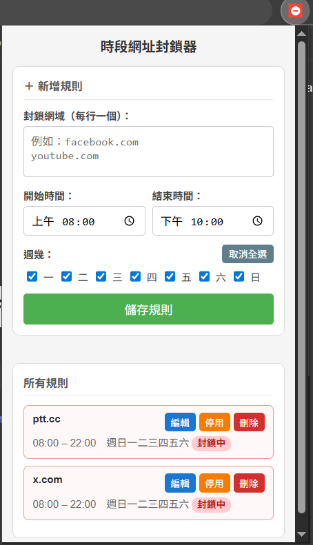

# 時段網址封鎖器 (BanUrl)

一款基於 **Chrome Manifest V3** 的瀏覽器擴充功能，讓你依照時段、星期自動封鎖指定網域，幫助控制上網習慣與提升專注力。

---

## 功能特色

- **時段封鎖**：設定開始與結束時間，支援跨午夜時間範圍（例如 22:00 ~ 02:00）
- **星期設定**：可選擇任意組合的週幾生效，一鍵全選 / 取消全選
- **多規則管理**：建立多條獨立規則，每條可個別啟用 / 停用
- **即時編輯刪除**：Popup 及設定頁皆可直接編輯、刪除現有規則
- **自訂封鎖訊息**：封鎖頁面顯示自訂文字
- **暫時覆寫**：可選擇性開放使用者點擊按鈕暫時解除封鎖 15 分鐘
- **匯入 / 匯出**：規則可匯出為 JSON 備份，並從 JSON 匯入還原
- **子網域匹配**：封鎖 `facebook.com` 同時封鎖 `www.facebook.com`、`m.facebook.com` 等所有子網域

---

## 安裝方式（開發者模式）

1. 下載或 clone 此專案
   ```bash
   git clone https://github.com/immortalnovayang/BanUrl.git
   ```
2. 開啟 Chrome，前往 `chrome://extensions/`
3. 開啟右上角的「**開發人員模式**」
4. 點擊「**載入未封裝項目**」
5. 選擇專案資料夾（`BanUrl/`）

---

## 使用方式

### Popup（點擊工具列圖示）



| 區域 | 說明 |
|------|------|
| 上方表單 | 新增規則；點「編輯」後切換為編輯模式，可修改現有規則 |
| 下方列表 | 顯示所有規則，含「封鎖中」即時狀態標籤 |
| 編輯 | 將規則資料帶入上方表單，按「更新規則」儲存 |
| 停用 / 啟用 | 暫時關閉或重新開啟規則 |
| 刪除 | 永久刪除規則 |

**預設值：** 開始時間 08:00、結束時間 22:00、全部星期勾選

### 設定頁（完整管理）

在 `chrome://extensions/` 點擊「詳細資訊」→「擴充功能選項」，或右鍵擴充功能圖示選「選項」。

- 自訂封鎖時顯示的訊息文字
- 啟用 / 停用暫時覆寫功能
- 完整規則 CRUD（新增、編輯、刪除、啟用/停用）
- 規則匯入 / 匯出（JSON 格式）

---

## 封鎖行為說明

### 網域比對規則
輸入 `facebook.com` 會封鎖：
- `facebook.com`
- `www.facebook.com`
- `m.facebook.com`
- 所有以 `.facebook.com` 結尾的子網域

輸入時不需加 `https://` 或 `www.`，系統會自動正規化。

### 跨午夜時間範圍
設定 `22:00 ~ 02:00`，封鎖效果為：晚間 10 點到隔日凌晨 2 點。

### 暫時覆寫
啟用覆寫功能後，封鎖頁面會出現「暫時解除封鎖 (15分鐘)」按鈕，點擊後 15 分鐘內可正常瀏覽；時間到後自動恢復封鎖。

---

## 所需權限說明

| 權限 | 用途 |
|------|------|
| `storage` | 儲存規則與設定 |
| `alarms` | 定期清除已過期的暫時覆寫狀態 |
| `tabs` | 預留供未來功能擴充 |
| `webRequest` | 觀察網路請求（非阻斷式） |
| `host_permissions: <all_urls>` | 在所有網站上執行 content script |

> 本擴充功能採用 **Manifest V3**，封鎖行為由 content script overlay 實作，符合 Chrome 最新安全規範。

---

## 專案結構

```
BanUrl/
├── manifest.json       # 擴充功能設定（MV3）
├── background.js       # Service Worker：規則判斷、訊息處理
├── content.js          # Content Script：封鎖頁面 Overlay
├── popup.html          # Popup UI
├── popup.js            # Popup 邏輯（新增 / 編輯 / 刪除規則）
├── options.html        # 設定頁 UI
├── options.js          # 設定頁邏輯
└── icons/              # 擴充功能圖示
    ├── icon16.png
    ├── icon32.png
    ├── icon48.png
    └── icon128.png
```

---

## 更新紀錄

### 1.1.0
- 升級為 Manifest V3，移除不相容的 `webRequestBlocking` 及 `<all_urls>` permission 錯誤
- 修正 Service Worker 中的 `localStorage` → `chrome.storage.session`
- Popup 支援完整規則編輯、刪除、啟用/停用
- 設定頁整合新增規則表單（不再跳出 popup 視窗）
- 新增「全選 / 取消全選」星期按鈕
- 預設開始時間 08:00、結束時間 22:00、全部星期勾選

### 1.0.0
- 初始版本：時段網址封鎖、自訂封鎖訊息、暫時覆寫、匯入/匯出規則
